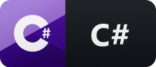
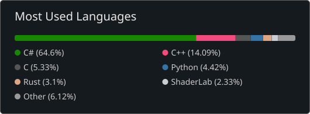
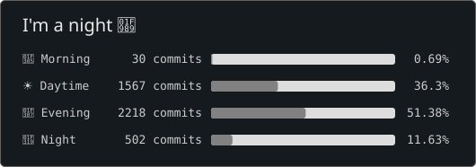
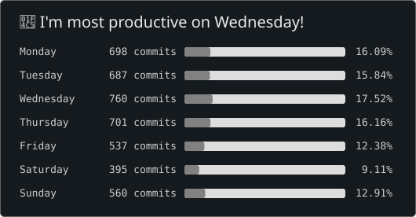

<!--# Hi there-->

## 📖 About me

💻 Currently working on: Random side projects

🧐 Things I like: C#, .NET, Gamedev, C++

🌱 I'm currently learning about: Engine development, rendering APIs

💡 Other interests: 3D modelling, graphic design

🎓 B.Sc. Applied Computer Science

💬 How to reach me: [Discord](JNI#3310) | [Twitter](https://twitter.com/jannik_jn) | [Email](janniknickel.info@gmail.com)

    <h2>💻 Languages and Tools</h2>
    

        <!--Badges from https://github.com/MikeCodesDotNET/ColoredBadges-->
        
        
        
        
        
        
        
    

    <h2>📈 Stats</h2>
    

        
    

     
    

        
    

     
    

        
    

<!--Tools for this readme:
* Generate monospaced font: https://yaytext.com/monospace/
* Stats inspired by: https://github.com/anuraghazra/github-readme-stats and https://github.com/athul/waka-readme
* Badges: https://github.com/MikeCodesDotNET/ColoredBadges
-->
