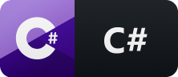

    <h1>Hi there</h1>
    <h2>I'm Jannik, self taught programmer and gamedev. Currently studying applied computer science and developing a game. I love learning about new stuff related to programming and software/game development. My favorite language is C#💙.</h2>
    

 

    <h2>✔️ Overview</h2>
    

        💻 Currently working on: [Ancient Warfare 3](https://store.steampowered.com/app/758990/Ancient_Warfare_3/)

        🧐 Things I like: C#, .NET Core, Gamedev, C++

        💬 How to reach me: [Discord](JNI#3310) | [Twitter](https://twitter.com/jannik_jn) | [Email](janniknickel.info@gmail.com)

        🌱 I'm currently learning about: Engine development, rendering APIs
        
        💡 Other interests: 3D modelling, graphic design
    

 

    <h2>💻 Languages and Tools</h2>
    

        <!--Badges from https://github.com/MikeCodesDotNET/ColoredBadges-->
        
        
        
        
        
        
        
        
    

 

    <h2>📈 Stats</h2>
    

        
    

     
    

        
    

     
    

        
    

